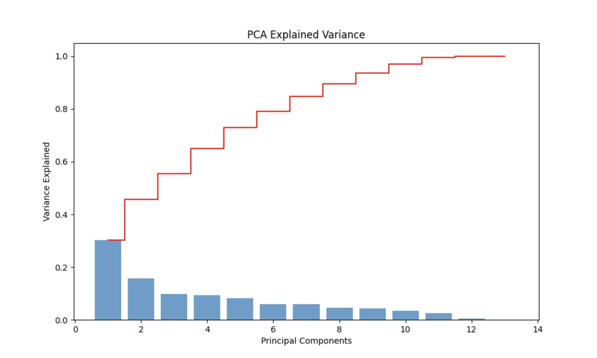
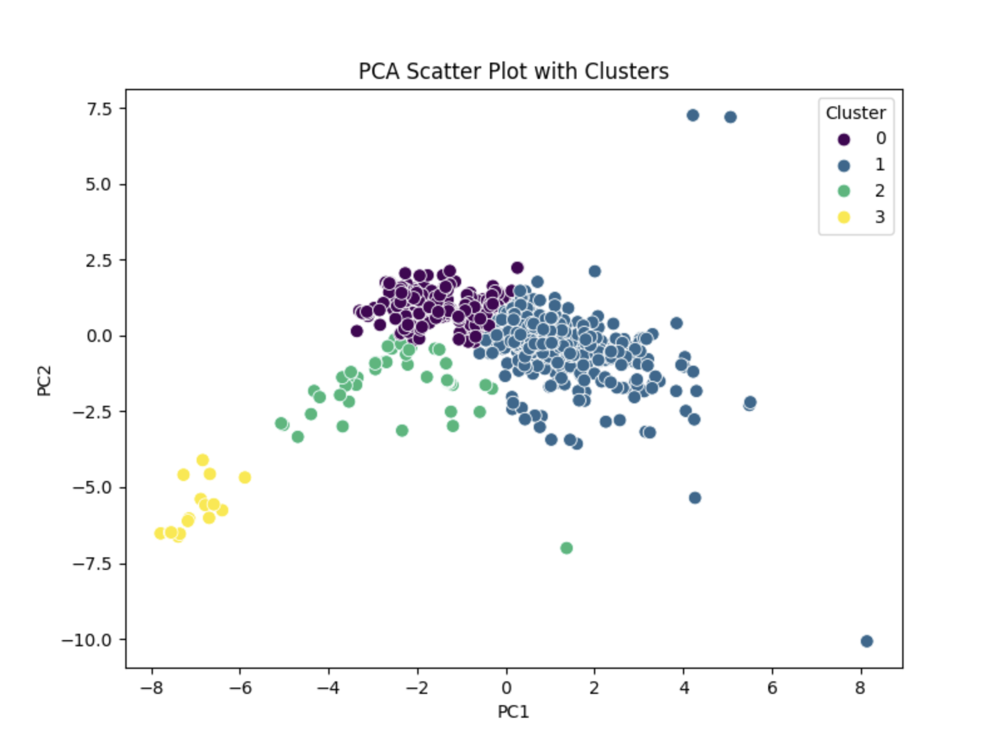

### Analiza pe componente principale

#### **Introducere**
Analiza pe Componente Principale (ACP) a fost folosită pentru a simplifica interpretarea dataset-ului nostru, reducând numărul de variabile. Prin această metodă, am urmărit să identificăm tipare în date și să înțelegem mai bine relațiile dintre variabile. Graficele prezentate mai jos arată cum contribuie fiecare componentă la explicația variației și cum sunt distribuite observațiile în spațiul redus al primelor două componente principale (PC1 și PC2).

---

#### **Analiza varianței explicate**

Graficul varianței arata că primele două componente principale sunt cele mai relevante. PC1 acaparează cea mai mare parte a variației din dataset, ceea ce înseamnă că există o relație principală între variabilele noastre. Pe scurt, majoritatea informației poate fi descrisă eficient folosind această primă componentă. 

PC2 adaugă o perspectivă complementară, scoțând în evidență detalii suplimentare care nu sunt surprinse de PC1. După aceste două componente, contribuția celorlalte scade considerabil, ceea ce face ca reducerea dataset-ului la doar două dimensiuni să fie atât practică. Practic, putem analiza datele într-un mod mai simplu fără a pierde informații esențiale.

---

#### **Analiza distribuției în spațiul PCA**

Graficul de dispersie al datelor în funcție de PC1 și PC2 arată o separare clară între mai multe clustere. Aceste clustere ne arată că există similarități evidente între observațiile din același grup, ceea ce sugerează că variabilele contribuie semnificativ la crearea acestor tipare. De exemplu, în cazul unor grupuri distincte, putem deduce că există caracteristici comune care diferențiază datele într-un mod logic și coerent.

Mai mult decât atât, distanțele dintre clustere indică faptul că avem categorii bine delimitate (între galben, verde și celelalte clustere). Asta arată că dataset-ul nostru nu este "zgomotos" și că există relații consistente între variabile. În același timp, punctele care apar izolate în afara clusterelor principale (observațiile atipice) sunt semnale importante. Acestea pot reprezenta cazuri speciale sau extreme, care fie trebuie analizate separat, fie corectate dacă sunt erori.

---

#### **Use case: identificarea tiparelor de smartphone-uri și utilizatori**
Unul dintre principalele obiective ale analizei ACP aplicate pe setul nostru de date este identificarea tiparelor în funcție de specificațiile tehnice ale smartphone-urilor și comportamentele utilizatorilor. Rezultatele PCA sugerează că putem utiliza această metodă pentru a clasifica dispozitivele în segmente distincte și pentru a înțelege preferințele consumatorilor, pornind de la specificațiile și prețurile lor. Clusterele evidențiate în graficul PCA ne oferă informații valoroase despre relațiile dintre dispozitive și despre tiparele comportamentale implicite.

##### **1. Smartphone-uri premium vs. mid-range și low-cost**
- **Dispozitive premium**: Modele precum iPhone Pro, Samsung S-Series sau OnePlus 11 sunt asociate cu specificații tehnice avansate (procesor rapid, RAM ridicat, display cu rezoluție înaltă) și prețuri mai mari. Aceste dispozitive sunt preferate de utilizatori care prioritizează performanța și funcțiile avansate.
- **Dispozitive mid-range**: Acestea includ modele echilibrate, cu specificații bune (procesor decent, RAM 6-8 GB, camere competitive) și prețuri moderate. Acest cluster este probabil asociat cu utilizatori care caută un raport bun între preț și performanță.
- **Dispozitive low-cost**: Modelele din acest cluster (ex. Motorola Moto G sau Samsung Galaxy A) sunt caracterizate de specificații de bază și prețuri accesibile, fiind preferate de utilizatorii care prioritizează costurile reduse peste performanță.

##### **2. Specificații neobișnuite sau observații atipice**
Punctele care ies din tiparele clusterelor principale pot reprezenta observații interesante:
- **Smartphone-uri de nișă**: Unele dispozitive din aceste puncte izolate ar putea fi smartphone-uri experimentale, modele cu specificații unice (ex. camere de 200 MP sau baterii extrem de mari) sau dispozitive lansate în ediții limitate.
- **Modele cu un raport preț-performanță neobișnuit**: Aceste observații ar putea indica smartphone-uri care oferă specificații premium la prețuri reduse sau, invers, dispozitive supraevaluate. Analizarea lor poate dezvălui oportunități pentru consumatori sau lacune în piață.

##### **3. Preferințele utilizatorilor pe baza specificațiilor tehnice**
Relațiile dintre specificații, precum procesorul, RAM-ul, și preț, ne oferă o perspectivă asupra preferințelor utilizatorilor:
- **Utilizatorii orientați spre performanță**: Aceștia aleg dispozitive cu procesoare rapide, memorie RAM ridicată și ecrane mari, chiar dacă aceste specificații vin la un cost ridicat.
- **Utilizatorii economici**: Preferă dispozitive low-cost, dar cu specificații acceptabile pentru utilizarea zilnică. Aceștia sunt mai sensibili la preț și mai puțin interesați de funcții avansate.
- **Fanii camerelor foto/video**: Există un cluster asociat cu smartphone-uri care au camere foto performante (50 MP+), iar utilizatorii acestor dispozitive tind să fie atrași de fotografia de înaltă calitate.

##### **4. Posibile tipare între iOS și Android**
Clusterele pot reflecta și diferențele dintre ecosistemele iOS și Android:
- iPhone-urile tind să formeze un cluster separat, datorită specificațiilor uniforme, prețurilor ridicate și ecosistemului Apple. Utilizatorii de iPhone sunt în general loiali brandului, ceea ce sugerează un comportament predictibil.
- Android acoperă o gamă mai diversificată de dispozitive, cu clustere ce variază între low-cost și premium. Acest lucru sugerează o bază de utilizatori mai eterogenă, cu preferințe variate.

---
#### **Concluzii**
Această analiză arată clar că dataset-ul nostru este structurat și poate fi bine descris prin doar două componente principale, fără a pierde informații importante. PC1 și PC2 explică cea mai mare parte a variației, ceea ce face analiza mai eficientă și mai ușor de interpretat. Este evident că variabilele contribuie în mod semnificativ la formarea clusterelor, ceea ce sugerează tipare clare în date.

Clusterele evidențiate în grafic ne oferă informații despre cum sunt grupate observațiile și ce relații există între variabile. Aceste grupuri pot reprezenta categorii sau tipologii relevante pentru setul nostru de date. În plus, observațiile atipice merită analizate mai departe, deoarece ar putea ascunde informații valoroase despre cazuri speciale sau situații rare.

Pe scurt, ACP ne-a ajutat să evidențiem structura dataset-ului și să identificăm tipare în date. Aceste concluzii oferă un punct de plecare pentru analize viitoare.