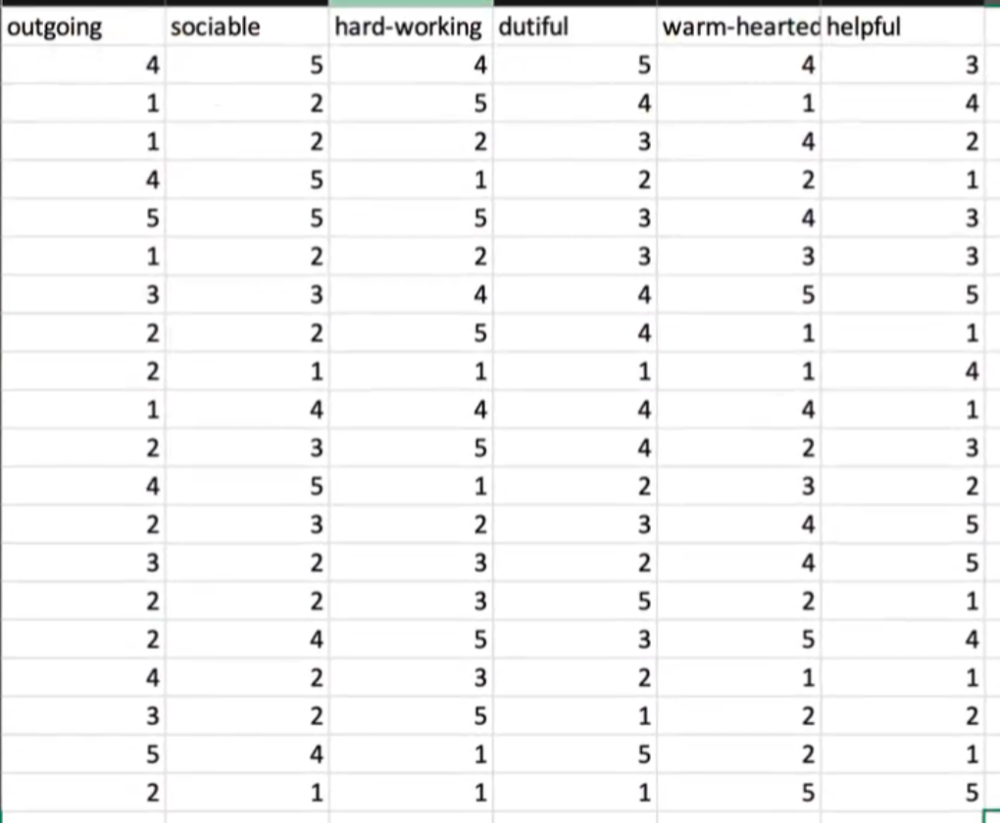
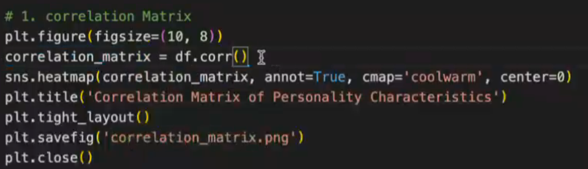
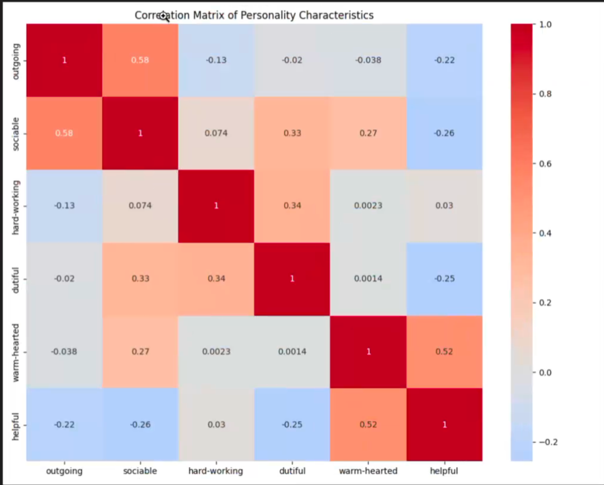
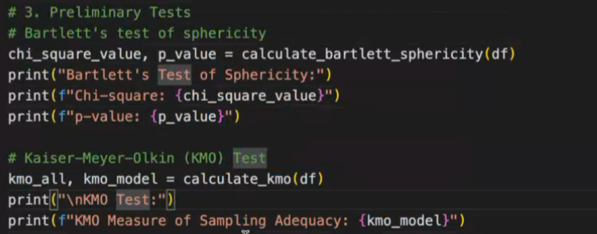

# Analiza factoriala

- Avem o serie de variabile si vedem daca avem corelatie intre variabile
- Punctul de start in analiza. Avem un set de caracteristici. Userul a indicat pe o scara de la 1 la 5 cat de mult considera el ca il descrie cuvantul:



## Pasii analizei

1. Citim din csv intr-un df

```python
import pandas as pd

df = pd.read_csv("csv_name.csv")
```

2. Curatam datele
  - Verificam daca avem valori lipsa si adaugam media
```python
val_lipsa = df.isna(); # intoarce un array de true sau false
# daca avem o variabila lipsa inlocuim cu media
```

3. Matricea de corelatie





- Indica cat de puternice sunt corelatiile intre elemente.
- Spre exemplu sociable si outgoing au o corelatie puternica. Asemanator este si pentru warm-hearded - healpful
- Corelatiile negative reprezinta o unitate cu care scade elementul X cand elementul Y creste cu o unitate. _Exemplu:_ dutiful si helpful

4. Standardizarea datelor

```python
# Varianta din trecut
import pandas as pd

# Varianta 2:
scaler = StandardScaler()
df_scaled = pd.DataFrame(scaler.fit_transform(df), column = df.columns) # pe df ul nostru este standardizat. Scaler NU intoarce un df, trebuie sa facem noi cast la DataFrame
```

5. Teste preliminare

- Analiza poate functiona si fara teste. Ele arata daca din punct de vedere statistic analiza este relevanta

- Sfericitatea modelului (Bartlett's test of sphericity)



- Bartlett's test of sphericity
  - Analizam Chi-square (>20)
  - Analizam p-value (<0.05)
- Kaiser-Meyer-Olkin (KMO):
  - Ne spune cat de relevant este acceptabil / reprezentativ
  - kmo_test (>0.6)

6. Analiza Factoriala

- Folosim FactorAnalyzer

```python
fa = FactorAnalyzer(rotation=None, n_factors=len(df.columns))
fa.fit(df)
```

7. Eigenvalues & Variance Explained

- Pentru fiecare factor avem un numar care explica ce factori reprezinta varianta
- 